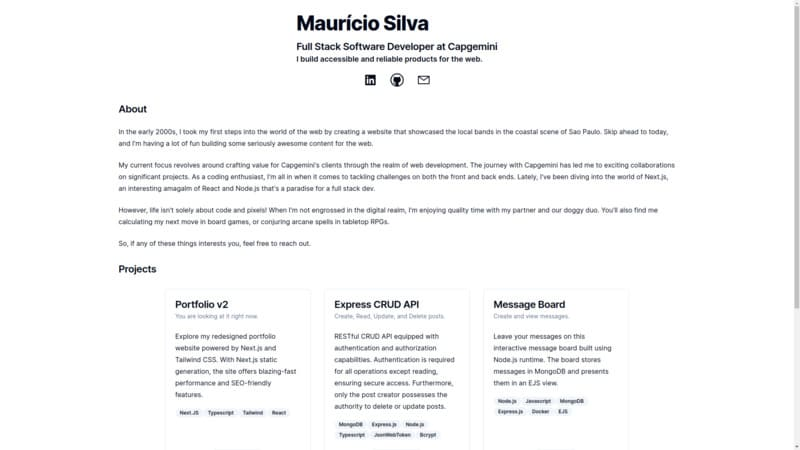

# Mauricio Silva Portfolio

Welcome to my personal portfolio website built using Next.js and Tailwind Css. This website showcases some of my projects in web development.

## Deployed

[Click here to see it live.](https://mauriciosilva.vercel.app/)

## Technologies Used

### Next.js 13.4

The portfolio was built using Next.js, a powerful React framework. Its static site generation (SSG) capabilities results in faster loadings and better search engine discoverability.

### Tailwind CSS 3.3

To style the portfolio, Tailwind CSS was employed, providing a utility-first approach to styling.
